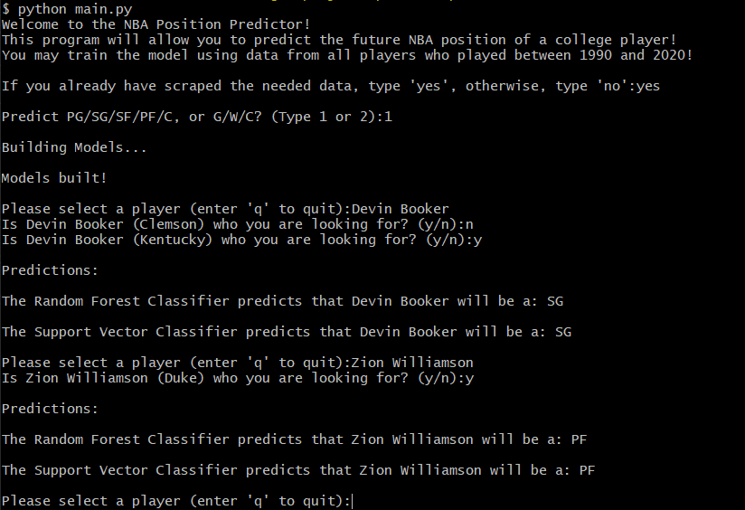

# nba-position-predictor
Scrapes data from the web and uses it to train ML 
classifiers that predict a college basketball player's 
future position in the NBA

# Required Libraries
* numpy
* sklearn
* pandas
* BeautifulSoup

# Instructions
Run main.py and follow the instructions given in the command line.

# Demo

